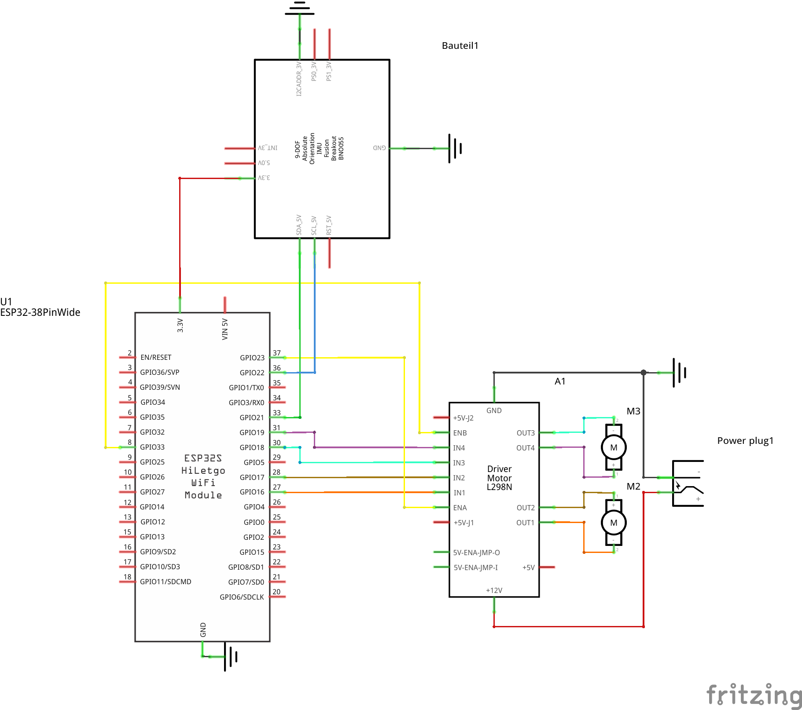
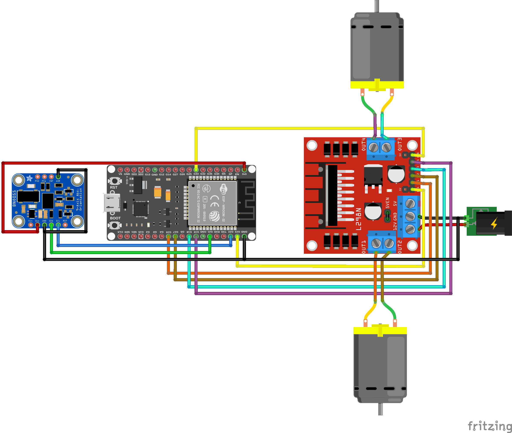
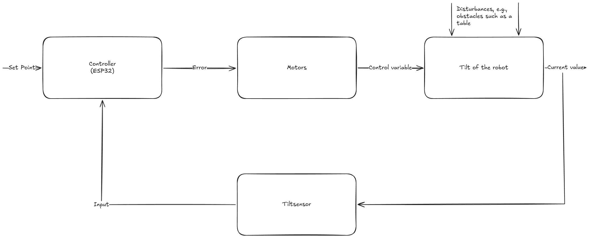
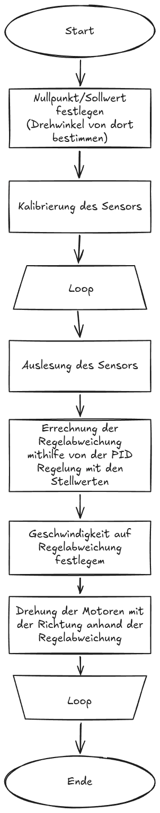

## InvertedPendulum
### Konzeptidee
Ein kleiner Roboter, der sich selbst balancieren kann, sodass er trotz nur zwei Rädern aufrecht stehen bleibt.
Die Motivation dahinter ist ein Schulprojekt, dessen Hauptfokus auf selbstregelnden Regelkreisen liegt. Dieser Roboter war dabei unsere Idee.

## Sprache
- Primäre Dokumentation (Englisch): [README.md](README.md)
- Deutsche Version: [README.de.md](README.de.md)

## Inhalt

1. [Hardware](#hardware)
    1. [Anforderungen](#anforderungen)
    2. [Pinbelegung](#pinbelegung)
    3. [Schaltplan](#schaltplan)
    4. [Breadboard](#breadboard)
2. [Software](#software)
    1. [Code](#code)
    2. [Regelkreis-Diagramm](#regelkreis-diagramm)
    3. [Programmablaufplan](#programmablaufplan)
3. [Betriebshinweise](#betriebshinweise)

## To Do

- [x] Ein CAD-Modell des Roboters erstellen
- [x] Verbindungen der Bauteile stabiler gestalten (basierend auf 3 Prototypen um so reliabel wie möglich zu gestalten, sichtbar in [Prototypen](/assets/Prototypes.jpg))
- [x] Ressourcensparender designen
- [x] Weniger Bauteile und somit einfacheres zusammenbauen und stabileres Halten
- [x] Feste Sensorhalterung in Platinenhalterung für stabile Werte
- [x] Rutschfeste Reifen designen
- [x] Verwenden der Platine aus einem alten Projekt um Ressourcen zu recyclen
- [x] Code schreiben, damit der Roboter sich aufrecht hält
- [ ] Code verbessern, damit die Kalibrierung per Smartphone möglich ist
    - [] Per BLE mit einer App verbinden ODER
    - [] Einen Webserver im eigenen WLAN öffnen
- [] leichtes Kippen verhindern
    - könnte an PID-Regelung liegen (nicht in der Lage kleine Winkel auszugleichen¹)
- [] Weitere Parameter bei Regelung beachten
    - So könnte z.B. verhindert werden, dass der Roboter große Distanzen zurücklegt (oder dies bewusst tut). Außerdem könnte das ungewollte drehen ausgeglichen werden, oder gesteuert werden

**Hinweise:**
1. Code unterbindet reagieren des Systems bei kleinen Winkel, jedoch wurde auch getestet ohne diese Hysterese und es funktionierte trotzdem nicht, da bei einem Winkel von ~1-2 Grad ein Output von wenigen Watt an den Motor kommt. Das würde nicht ausreichen um das auszugleichen --> hier müsste also eine Anpassung geschrieben werden, welche aggressiver auf kleine Werte reagiert.

## Erneuerungen

`
In der ersten Version des Modells waren die Verbindungen mit Slidern ausgestattet. Diese sollten das zusammenbauen vereinfachen, leider stellte sich schnell heraus, dass diese bei etwas zu viel Kraft sich zu einfach lösten. Dieses Problem behoben wir indem wir neue Verbindungen designten die deutlich stabiler waren und alle Freiheitsgrade unterbunden waren durch einen Einrastmechanismus. Außerdem haben wir verschiedene Unterbauteile verbunden zu größeren Bauteilen, welche auch für mehr Stabilität sorgten. Die alten Versionen können in der git history eingesehen werden. 
`

# Hardware
## Anforderungen

- 2 x Getriebemotoren ~600 RPM
    - 2 x M3-Schrauben 7,3 mm --> Senkkopf (Flachkopf)¹
- ESP32
- BNO055 9DoF Sensor²
- H-Bridge (z. B. HW-095 L298N)
- CAD-3D-Druckteile ([siehe hier](TechDrawRework.pdf))³

**Hinweise:**
1. Die Schrauben sind vom verwendeten Getriebemotor abhängig.
2. Wir haben dieses selbst erstellte [Wiki](https://github.com/Leolion2023/BNO055) genutzt, weil die Bosch-Dokumentation schwer verständlich ist.
3. Falls es Probleme bei der Anzeige der technischen Zeichnung gibt, lade die Datei bitte herunter und öffne sie in einem modernen PDF-Viewer.

## Pinbelegung

| ESP32 Pin | Funktion | Zusatz |
|---|---|---|
| GPIO16 | H-Bridge IN1 | Verwendet für Motor 1 |
| GPIO17 | H-Bridge IN2 | Verwendet für Motor 1 |
| GPIO23 | H-Bridge ENA | Verwendet für Motor 1 |
| GPIO18 | H-Bridge IN3 | Verwendet für Motor 2 |
| GPIO19 | H-Bridge IN4 | Verwendet für Motor 2 |
| GPIO33 | H-Bridge ENB | Verwendet für Motor 2 |
| GPIO21 | BNO055 SDA | |
| GPIO22 | BNO055 SCL | |
|  3.3V  | BNO055 VIN | |
|   GND  | BNO055 GND | |
|   GND  | BNO055 ADD | |
|  ---   | BNO055 INT | -nicht verwendet- |
|  ---   | BNO055 RST | -nicht verwendet- |
|  ---   | BNO055 BOOT | -nicht verwendet- |

## Schaltplan

## Breadboard

# Software

## Code
Der Hauptcode befindet sich in [src/src/main.cpp](src/src/main.cpp).
Zum Flashen des ESP32 haben wir PlatformIO genutzt. Passe es bei Bedarf an deine Anforderungen an.

## Regelkreis-Diagramm

## Programmablaufplan
Derzeit leider nur auf Deutsch verfügbar.

**Beide Diagramme wurden mit [excalidraw.com](https://excalidraw.com) erstellt.**

# Betriebshinweise

### Elektrischer Start

Der Roboter benötigt zwei getrennte Spannungsversorgungen: eine Logikspannung und eine Motorspannung. Die Logikspannung kann über den USB-C-Anschluss des ESP32, den VIN-Pin mit 3.3V-5V oder den 3.3V-Pin bereitgestellt werden, empfohlen wird jedoch der Anschluss auf der Platine direkt neben dem ESP Oben. Die Motorspannung muss entweder direkt an der H-Bridge am 12V- und GND-Anschluss angeschlossen werden, oder auf der Platine auf der Hauptspannungsversorgung.
Da du die PID-Werte wahrscheinlich kalibrieren musst, ist es am einfachsten, den ESP32 mit einem Computer zu verbinden, auf dem entweder PlatformIO oder die Arduino IDE installiert ist:

**Für PlatformIO:**
1. PlatformIO auf Laptop/PC/etc installieren
2. CustomLibrary für BNO055 installieren (oben verlinkt), oder offizielle von Bosch (keine Garantie auf Updates)
3. Code, wie in folgendem Kapitel anpassen
4. Roboter auf Ebene Fläche stellen, sodass Reifen nicht auf dem Boden stehen (für Kalibrierung am Anfang)
5. ESP32 anschließen und hochladen

**Für ArduinoIDE:**
1. Arduino IDE installieren
2. Bibliothek installieren ([entweder über Bibliotheken von Arduino oder als Datei](https://docs.arduino.cc/software/ide-v1/tutorials/installing-libraries/))
3. Code, wie in folgendem Kapitel anpassen
4. Roboter auf Ebene Fläche stellen, sodass Reifen nicht auf dem Boden stehen (für Kalibrierung am Anfang)
5. ESP32 anschließen und hochladen

### Code-Anpassungen

Es gibt einige einfache Anpassungen, die vorgenommen werden müssen. Ganz oben stehen die drei PID-Konstanten, die auf den Roboter abgestimmt werden müssen. Danach gilt: Das Constraint begrenzt den Maximalwert des PID-Ausgangs. Typischerweise ist 255.0 sinnvoll, da das der Maximalwert von PWM ist. Der MinimalConstraint verhindert, dass sich die Motoren bei geringer Leistung drehen, da dies dem Motor schaden kann, durch das schnelle ein-/ausschalten der Stromversorgung. Die Variable `inverted` steuert die Drehrichtung der Motoren. Falls der Roboter in die falsche Richtung regelt, ändere sie auf -1.0 oder 1.0.

### Hardware-Informationen

Zum Bau des Roboters kannst du einfach die technischen Zeichnungen verwenden. Kleine Anpassungen an den Variablen der CAD Dateien können die Verbindungen noch verbessern, können allerdings auch zu Fehlern führen.

**Hinweise:**
1. Wir haben die Motoren aktuell parallel geschalten auf einem Channel der H-Brücke, da die Motoren sich bei uns sonst unterschiedlich gedreht haben. Dies könnte außerdem ausgeglichen werden durch Code der auch die anderen Dimensionen des BNO055 abruft und so versucht auf einer Stelle zu bleiben.