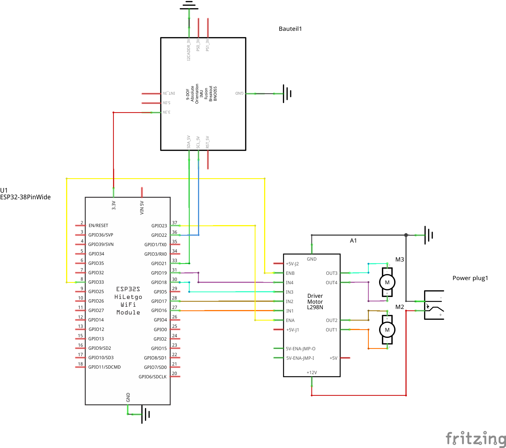
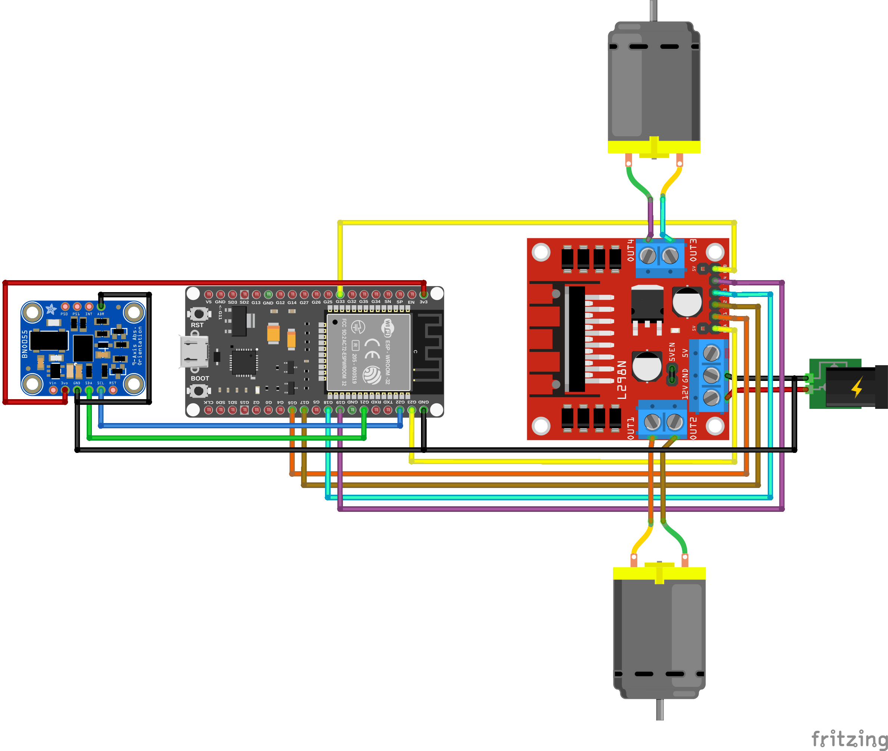
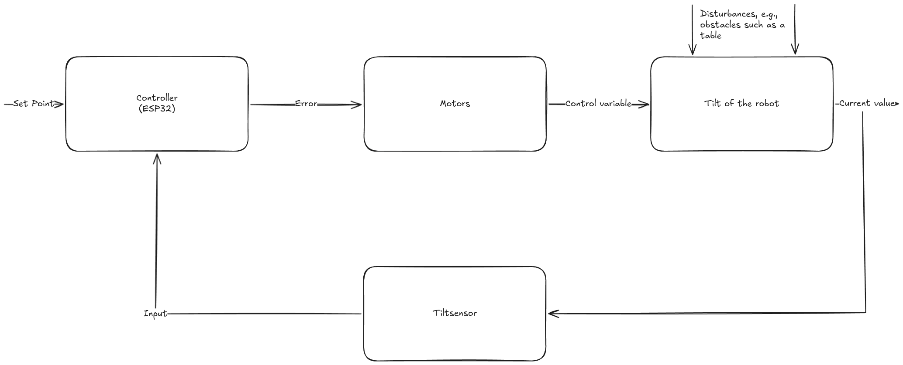
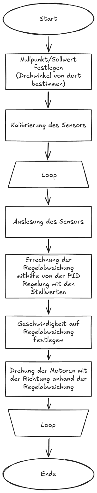

## InvertedPendulum
### Concept Idea
A small robot which can balance itself so it always stands up even though it only has two wheels.
The motivation behind this is a school project whose main focus is on self-regulating control loops. This robot was our project idea.

## Language
- Primary documentation (English): [README.md](README.md)
- German translation: [README.de.md](README.de.md)

## Contents

1. [Hardware](#hardware)
    1. [Requirements](#requirements)
    2. [Pinout](#pinout)
    3. [Schematic](#schematic)
    4. [Breadboard](#breadboard)
2. [Software](#software)
    1. [Code](#code)
    2. [Control Loop Diagram](#control-loop-diagram)
    3. [Program Flow Chart](#program-flowchart)
3. [Operating Instructions](#operating-instructions)

## To Do

- [x] Create a CAD Model of the robot
- [x] Code to simply drive the robot so it always stands up
- [ ] Improve the code so it can be calibrated using a phone
    - Connect via BLE to an app OR
    - Open a webserver on its own WiFi

# Hardware
## Requirements

- 2 x Gearmotors ~600 RPM
    - 2 x M3 Screws 7.3mm  --> countersunk head (flat head)¹
- ESP32
- BNO055 9DoF Sensor²
- H-Bridge (e.g. HW-095 L298N)
- CAD 3D prints ([see here](TechDraw.pdf))³

**Notes:**
1. The screws depend on the gearmotor you use.
2. We used this self-created [wiki](https://github.com/Leolion2023/BNO055) for this sensor because Bosch's documentation is hard to follow.
3. If you have issues viewing the technical drawing in the browser, please download the file and open it in a modern PDF viewer.

## Pinout

| ESP32 Pin | Function | Additional |
|---|---|---|
| GPIO16 | H-Bridge IN1 | Used for Motor 1 |
| GPIO17 | H-Bridge IN2 | Used for Motor 1 |
| GPIO23 | H-Bridge ENA | Used for Motor 1 |
| GPIO18 | H-Bridge IN3 | Used for Motor 2 |
| GPIO19 | H-Bridge IN4 | Used for Motor 2 |
| GPIO33 | H-Bridge ENB | Used for Motor 2 |
| GPIO21 | BNO055 SDA | |
| GPIO22 | BNO055 SCL | |
|  3.3V  | BNO055 VIN | |
|   GND  | BNO055 GND | |
|   GND  | BNO055 ADD | |
|  ---   | BNO055 INT | -not used- |
|  ---   | BNO055 RST | -not used- |
|  ---   | BNO055 BOOT | -not used- |

## Schematic

## Breadboard

# Software

## Code
The main code is in [src/src/main.cpp](src/src/main.cpp).
We used PlatformIO to flash the ESP32. Adapt it to your needs as required.

## Control loop diagram

## Program Flowchart
Unfortunately, currently only in German.

**Both diagrams were created with the website [excalidraw.com](https://excalidraw.com).**

# Operating Instructions

### Electrical start

The robot needs two separate power supplies: a logic voltage and a motor supply voltage. The logic voltage can be connected through the USB-C port of the ESP32, the VIN pin with 3.3V-5V, or the 3.3V pin. The motor voltage needs to be connected directly to the H-Bridge at the 12V and GND connector.
As you will most likely need to calibrate the PID set values, the best option is to connect the ESP32 to a computer with either PlatformIO or Arduino IDE installed.

### Code adjustments

There are some simple adjustments that need to be done. At the very top are the three `PID constants`, which must be tuned for your robot. The `constraint` sets the maximum value for the PID output; `255.0` is usually fine and mainly limits motor speed. The `inverted` variable controls the motor direction. If the robot drives in the wrong direction, change it to `-1.0` or `1.0`.

### Hardware information

To build the robot, you can use the technical drawings. The only thing that should be tested is the offset in the FreeCAD files. This changes the offset of the sliders and can be used if the connections are too loose.